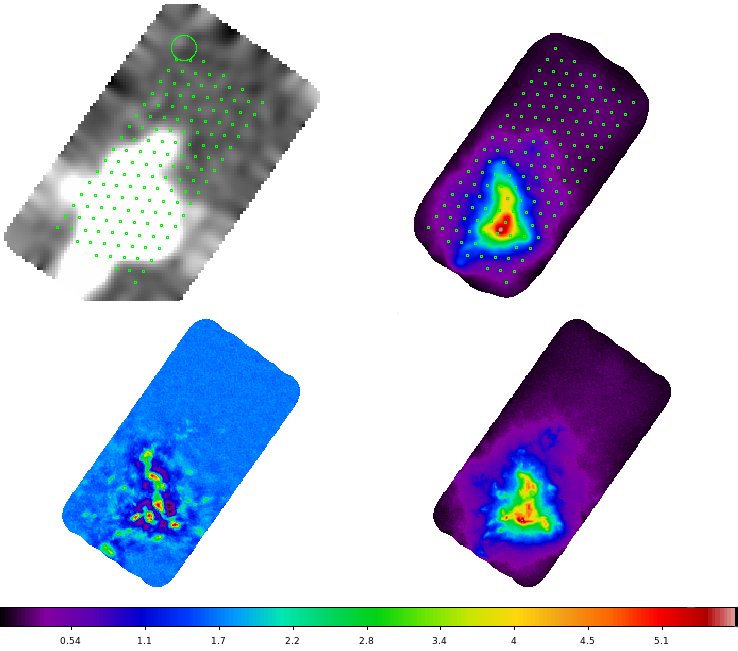

# Quick Array Combinations (QAC)

QAC provides a set of functions that mostly call CASA tools and tasks
to help you combining data from a single dish and interferometer.
QAC hides some of the complexity of writing CASA scripts and
provide a simple interface to array combination tools and tasks in
CASA.

This project was conceived alongside the TP2VIS project, where it was
used to provide an easier way to call CASA, and perform regression
tests. We still keep these within QAC as they are not distributed with
[TP2VIS](https://github.com/tp2vis/distribute). In an earlier version
these functions were called QTP.  We also use QAC for an ngVLA design
study.

See the
[INSTALL](INSTALL)
file for ways how to install and use these functions in your
[CASA](https://casa.nrao.edu/casa_obtaining.shtml)
shell. 

## Example

Below a plot in which the top left panel is a selected channel from an
ALMA total power (TP) observation of the CO emissions of a small
region in the SMC. Overlayed on this greyscale are the pointing
centers of the 12-m Array. For one pointing the true extend of the 12
m field of view is given as well with the larger green circle.  The
top right panel is the reconstructed TP map from the
pseudo-visibilities generated from a virtual interferometer emulating
the short spacings. The pure interferometric map that combines the 7m
and 12 m data is shown in the lower left panel, and combining the TP
visibilities with those of the 7m+12m arrays are then shown in the
lower right panel, now recovering the large scale flux, as well as the
finer scale structure.

## Example Workflows

In addition to TP2VIS' standard 
[M100 example](https://github.com/tp2vis/distribute/blob/master/example1.md)
we have several workflows, some of which also served as regressions tests during the TP2VIS development. We keep those
here for reference, although most need to be updated for QAC and need updated graphics. (soon, i promise)

* [workflow1:](workflows/workflow1.md) ALMA **cloud197** (LMC)  [our standard regression test]
* [workflow2:](workflows/workflow2.md) ALMA **SWBarN** (SMC)  [private data]
* [workflow3:](workflows/workflow3.md) Combining VLA with GBT [under development]
* [workflow4:](workflows/workflow4.md) Synthetic SkyModel Simulations (see also [MAP4SIM](map4sim.md) how to create models) 
* [workflow5:](workflows/workflow5.md) ALMA **Lupus 3 MMS** [private data]
* [workflow6:](workflows/workflow6.md) ALMA **M100** science verification (this should follow [example1](example1.md)) [example demo, including regression]

Example public datasets for some of these workflows can be found in http://admit.astro.umd.edu/~teuben/TP2VIS (currently 4 and 6). For
other workflows, contact us if the PI has released the data.

### Benchmarks

A better supported show of QAC functionality is currently in the **test/bench.py, bench0.py** and **sky1.py** routines [March 2018] as those were used in the
[SD2018](https://github.com/teuben/sd2018) workshop. Please note the software in that repo is not maintained anymore, and updated versions can be found
within QAC.

## References

* CASA reference manual and cookbook : http://casa.nrao.edu/docs/cookbook/
   * Measurement Set: https://casa.nrao.edu/casadocs/latest/reference-material/measurement-set
   * MS V2 document: [MS v2 memo](https://casa.nrao.edu/casadocs/latest/reference-material/229-1.ps/@@download/file/229.ps)
* CASA simulations: https://casa.nrao.edu/casadocs/latest/simulation
  * Simulations (in 4.4) https://casaguides.nrao.edu/index.php/Simulating_Observations_in_CASA_4.4
  * See also our [workflow4](workflow4.md)
* CASA single dish imaging:  https://casa.nrao.edu/casadocs/latest/single-dish-imaging
  * Mangum et el. 2007:  [OTF imaging technique](https://www.aanda.org/articles/aa/pdf/2007/41/aa7811-07.pdf)
* CASA feather: https://casa.nrao.edu/casadocs/latest/image-combination/feather
* CASA data weights and combination:  https://casaguides.nrao.edu/index.php/DataWeightsAndCombination
* Nordic Tools SD2VIS: https://www.oso.nordic-alma.se/software-tools.php
* Kauffman's *Adding Zero-Spacing* workflow: https://sites.google.com/site/jenskauffmann/research-notes/adding-zero-spa
* Papers of interest:
  * [Ekers and Rots]()
  * Braun and Walterbos  197x?
  * Vogel et al.   1984?
  * [Jorsater and van Moorsel 1995](http://adsabs.harvard.edu/abs/1995AJ....110.2037J)
  * [Kurono, Morita, Kamazaki 2009](http://adsabs.harvard.edu/abs/2009PASJ...61..873K)
  * [Koda et al. 2011](http://adsabs.harvard.edu/abs/2011ApJS..193...19K)
